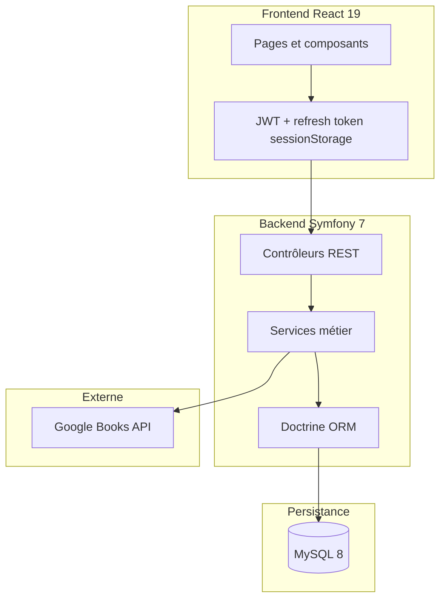

# LetterBook — Documentation technique

Document de référence pour la mise en œuvre du CDCF v2 (cahier des charges fonctionnel LetterBook).

## 1. Architecture



| Couche | Technologie |
|--------|-------------|
| Frontend | React 19, TypeScript, Vite 8, Tailwind CSS 4, Axios |
| Backend | Symfony 7.3, API Platform-ready REST JSON |
| Auth | Lexik JWT (TTL 30 min) + Gesdinet refresh token (30 j) |
| BDD | MySQL 8, schéma MERISE |
| Tests | PHPUnit 13 (backend), Playwright (smoke E2E) |

### Modèle de données principal

- `utilisateur` — compte, rôles, RGPD, `last_login_at`
- `livre`, `bibliotheque` — catalogue et suivi de lecture
- `avis`, `commentaire`, `like` — interactions
- `user_follow`, `notification` — réseau social
- `signalement` — file de modération (FP5 / FC2)
- `refresh_tokens` — jetons de rafraîchissement JWT

Les avis et commentaires acceptent un `id_utilisateur` nullable pour l’anonymisation RGPD.

---

## 2. Conformité CDCF — choix de mise en œuvre

### FP1 — Gestion des comptes

| Exigence | Implémentation | Validation |
|----------|----------------|------------|
| Inscription / connexion | `RegistrationController`, firewall `json_login` | `RegistrationApiTest`, `MeApiTest` |
| Profil | `MeController` PATCH, upload photo | `MeApiTest` |
| Suppression | `AccountDeletionService` — anonymise avis/commentaires, supprime données perso | `MeExportAndDeleteApiTest` |

### FP2 — Recherche de livres

- Recherche locale (titre, auteur, ISBN) + Google Books (`GoogleBooksService`, cache local via entité `Livre`).
- Tests : `BookApiTest`, `GoogleBooksServiceTest`.

### FP3 — Bibliothèque

- Statuts `a_lire` / `en_cours` / `termine`, progression 0–100 %.
- Tests : `LibraryApiTest`.

### FP4 — Avis

- CRUD, 1 avis/livre/utilisateur, distribution des notes.
- Tests : `ReviewApiTest`.

### FP5 — Interaction communautaire

| Exigence | Implémentation |
|----------|----------------|
| Profils / avis publics | `ProfileController`, accès public dans `security.yaml` |
| Like / commentaire | `ReviewController` |
| Commentaire ≤ 500 car. | Validation backend + `maxLength` frontend |
| Anti-spam 5 s | `CommentaireRepository::findLastByUser()` |
| Signalement | Entité `Signalement`, `ReportController`, file admin |

Tests : `ReportApiTest`, `ReviewApiTest::testCommentMaxLengthAndAntiSpam`.

### FC1 — Fil d’actualité

- `FeedTimelineService`, scopes `following` / `friends` / `community`, livres populaires.
- Tests : `FeedApiTest`.

### FC2 — Administration

- Suspension utilisateurs, liste signalements, suppression avis/commentaires.
- UI : `AdminPage` (onglets Utilisateurs / Signalements).
- Tests : `AdminApiTest`, `ReportApiTest`.

### FCT1 — Sécurité

| Mesure | Implémentation |
|--------|----------------|
| bcrypt cost ≥ 10 | `security.yaml` `when@prod` cost 12 |
| JWT 30 min + refresh | `lexik_jwt_authentication.token_ttl: 1800`, Gesdinet bundle, `POST /api/token/refresh` |
| ORM / requêtes préparées | Doctrine ORM |
| XSS | Échappement React, `stripHtml` pour résumés |
| CSRF | `GET /api/csrf`, header `X-CSRF-Token` sur register/login |
| Rate limiting login | Symfony RateLimiter : 5 / 15 min par IP |
| Rôles | `ROLE_USER`, `ROLE_ADMIN`, `access_control` |
| HTTPS | Guide [`DEPLOIEMENT.md`](DEPLOIEMENT.md) |

Tests : `LoginSecurityApiTest`.

### FCT3 — RGPD

| Mesure | Implémentation |
|--------|----------------|
| Consentement inscription | Case non pré-cochée, champ `consentementRgpd` |
| Export données | `GET /api/me/export`, `UserDataExportService` |
| Suppression + anonymisation | `AccountDeletionService` |
| Purge inactivité 12 mois | Commande `app:purge-inactive-users` |
| Bandeau cookies | `CookieConsentBanner` (localStorage) |

Tests : `MeExportAndDeleteApiTest`, `RegistrationApiTest`.

### FCT2 — Performance

- Objectif : 95 % des requêtes < 3 s, 200 utilisateurs simultanés.
- Validation infra : déploiement, cache HTTP, MySQL indexé ; tests de charge documentés comme procédure manuelle (k6/Artillery).

---

## 3. Endpoints API (sélection)

### Auth & compte

| Méthode | Route | Description |
|---------|-------|-------------|
| GET | `/api/csrf` | Jeton CSRF |
| POST | `/api/register` | Inscription (CSRF requis) |
| POST | `/api/login` | Connexion JWT + refresh token (CSRF, rate limit) |
| POST | `/api/token/refresh` | Renouvellement JWT |
| GET | `/api/me/export` | Export RGPD JSON |
| DELETE | `/api/me` | Suppression compte (anonymisation) |

### Modération

| Méthode | Route | Description |
|---------|-------|-------------|
| POST | `/api/reviews/{id}/report` | Signaler un avis |
| POST | `/api/comments/{id}/report` | Signaler un commentaire |
| GET | `/api/admin/reports?status=pending` | File modération |
| PATCH | `/api/admin/reports/{id}` | Résoudre / rejeter |
| DELETE | `/api/admin/avis/{id}` | Supprimer avis |
| DELETE | `/api/admin/comments/{id}` | Supprimer commentaire |

Voir le code source des contrôleurs dans `backend/src/Controller/` pour la liste complète (~40 routes).

---

## 4. Commandes utiles

```bash
# Migrations
php bin/console doctrine:migrations:migrate

# Admin par défaut
php bin/console app:seed-admin

# Purge comptes inactifs (simulation)
php bin/console app:purge-inactive-users --dry-run

# Tests backend
php bin/phpunit
```

---

## 5. Stratégie de tests et résultats

| Suite | Fichiers | Couverture |
|-------|----------|------------|
| PHPUnit functional | 15+ | Auth, livres, bibliothèque, avis, fil, social, admin, signalements, RGPD, sécurité |
| PHPUnit unit | 6 | Google Books, import, normalizer, ISBN, feed, social |
| Playwright smoke | 5 | Bibliothèque, recherche, discover, profil, paramètres |

**Résultat recette backend (dernière exécution)** : 47 tests, 440 assertions — OK.

---

## 6. Déploiement

Voir [`DEPLOIEMENT.md`](DEPLOIEMENT.md) pour TLS, variables d’environnement, checklist Go/No-Go.

Variables critiques : `DATABASE_URL`, `JWT_*`, `CORS_ALLOW_ORIGIN`, `GOOGLE_BOOKS_API_KEY` (optionnel).

---

## 7. Évolutivité

- API REST découplée du frontend React.
- Services métier isolés (`ReportService`, `AccountDeletionService`, `FeedTimelineService`).
- Migrations Doctrine versionnées.
- Extension possible : notifications email, recherche Elasticsearch, cache Redis.
